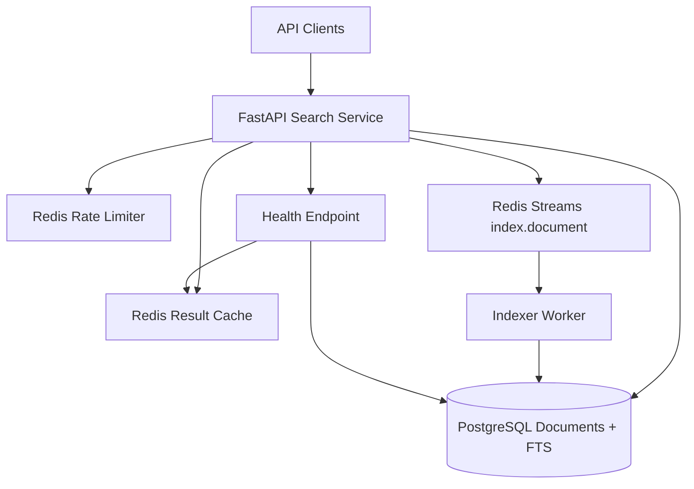
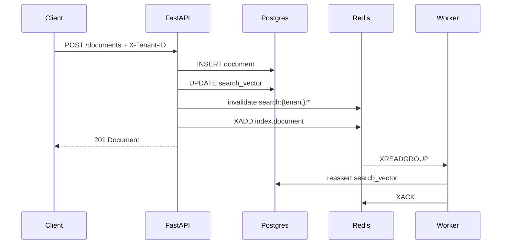
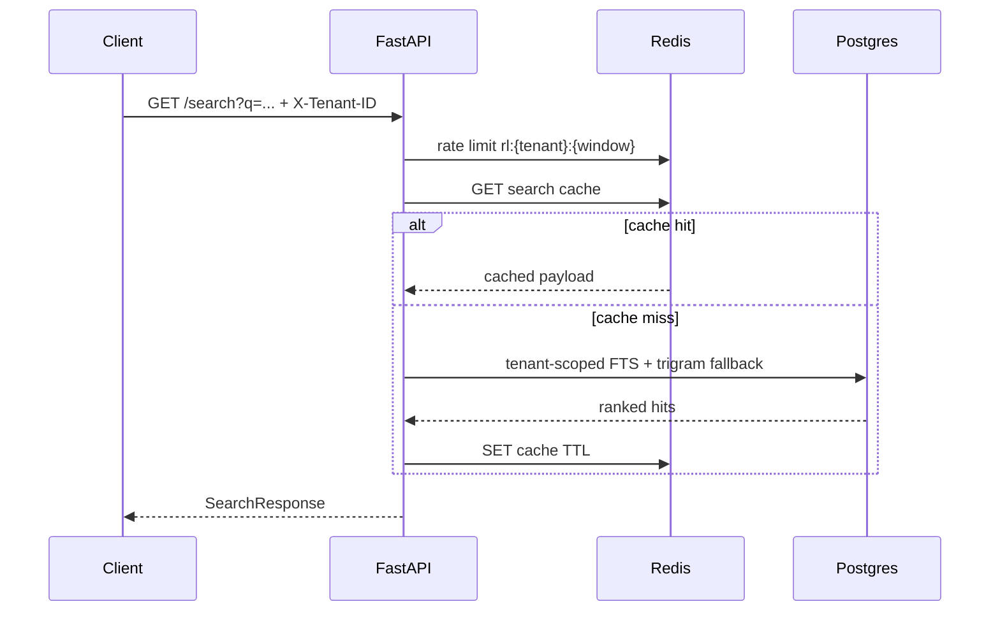

# Architecture Design — Distributed Document Search Service

## 1. High-level system architecture



**Prototype mapping**

| Concern | Prototype | Production direction |
|---------|-----------|----------------------|
| Document store | PostgreSQL | PostgreSQL / object store for blobs + metadata DB |
| Search | Postgres FTS (`tsvector`) | OpenSearch / Elasticsearch cluster, tenant-aware indexes |
| Cache | Redis | Redis Cluster / CDN for anonymized hot queries |
| Async indexing | Redis Streams | Kafka / Pulsar with DLQ and replay |
| Multi-tenancy | `X-Tenant-ID` + row filter | JWT claims + RLS / index-per-tenant |

## 2. Data flows

### Indexing



### Search



## 3. Storage strategy

**PostgreSQL** is the source of truth for documents and, in the prototype, the search engine:

- `documents.search_vector` is a weighted `tsvector` (title = A, content = B)
- GIN index on `search_vector` for ranked retrieval via `websearch_to_tsquery` + `ts_rank_cd`
- `pg_trgm` GIN index on `title` enables fuzzy / typo-tolerant fallback
- Tenant isolation is enforced in every query with `WHERE tenant_id = :tenant`

**Why not Elasticsearch in the prototype?** Compose + ES adds operational weight for a 3–4 hour assessment. Postgres FTS still demonstrates ranking, indexing, and tenant scoping. Production search should move to OpenSearch for shard scaling, analyzers, highlighting, aggregations/facets, and cross-cluster replication.

**Redis** provides:

1. Search result cache (`search:{tenant}:{hash}`)
2. Document cache (`doc:{tenant}:{id}`)
3. Fixed-window rate limits (`rl:{tenant}:{minute}`)
4. Indexing queue (Redis Streams)

## 4. API design

| Method | Path | Notes |
|--------|------|-------|
| `POST` | `/documents` | Body: `{title, content, metadata?}` |
| `GET` | `/documents/{id}` | Tenant-scoped; 404 on cross-tenant |
| `DELETE` | `/documents/{id}` | Hard delete + cache invalidation |
| `GET` | `/search?q=&tenant=&limit=&offset=` | Tenant via `X-Tenant-ID` and/or `tenant` query param |
| `GET` | `/health` | Reports Postgres + Redis; **503** when degraded |

**Example create**

```json
POST /documents
X-Tenant-ID: acme
{"title": "Invoice policy", "content": "Net-30 payment terms...", "metadata": {"dept": "finance"}}
```

**Example search response**

```json
{
  "query": "invoice",
  "tenant_id": "acme",
  "results": [
    {"id": "...", "title": "Invoice policy", "snippet": "...", "score": 0.42, "highlight": "<em>Invoice</em> policy — ..."}
  ],
  "total": 1,
  "took_ms": 12.4,
  "cached": false
}
```

## 5. Consistency model and trade-offs

| Operation | Consistency | Trade-off |
|-----------|-------------|-----------|
| GET document by id | Strong (Postgres) | Read-your-writes after create |
| Search results | Eventually consistent (async worker reassert) | Lower write latency vs brief search lag |
| Cache | TTL + write invalidation | Stale window up to TTL if invalidation races |

Prototype updates `search_vector` synchronously on write **and** enqueues a worker job so the async path is real and production-like. Deletes are immediately removed from Postgres; the stream message is ack-only for deletes.

## 6. Caching strategy

- **L1 (Redis):** hashed query keys per tenant, TTL ~45s
- **Invalidation:** on create/delete, `SCAN` + `UNLINK` for `search:{tenant}:*` and drop `doc:{tenant}:{id}`
- **Production:** prefer cache versioning (`search:{tenant}:v{n}:...`) over SCAN; add negative caching carefully; consider request coalescing for hot keys

## 7. Message queue usage

Redis Streams topic `index.document` carries `{document_id, tenant_id, action}`.

- Consumer group `indexers` enables horizontal worker scale
- Prototype does not implement DLQ; production should use retry + dead-letter + metrics on lag

## 8. Multi-tenancy and isolation

1. Tenant via `X-Tenant-ID` and/or `?tenant=` (must match if both set)
2. Auto-provision tenant row on first write
3. All reads/writes filter by `tenant_id`
4. Cross-tenant access returns **404** (no existence leak via 403)
5. Rate limits apply to **all** document and search routes; cache keys are tenant-partitioned
6. Redis cache/rate-limit failures degrade gracefully (cache miss / fail-open limiter) so Postgres search remains available

**Future isolation tiers:** Postgres RLS, schema-per-tenant for regulated customers, or dedicated OpenSearch index aliases per tenant for noisy-neighbor control.
