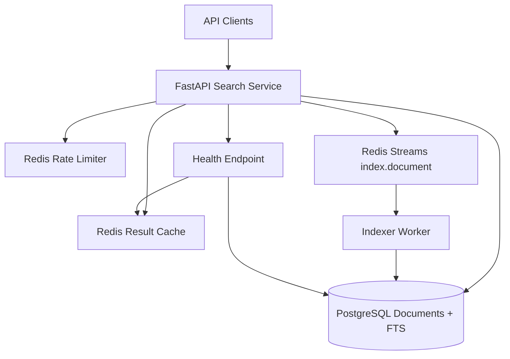
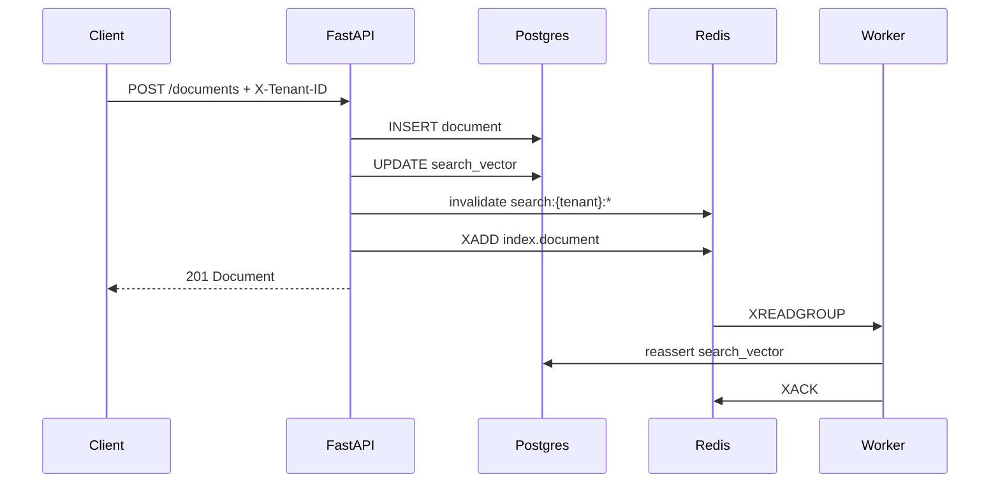
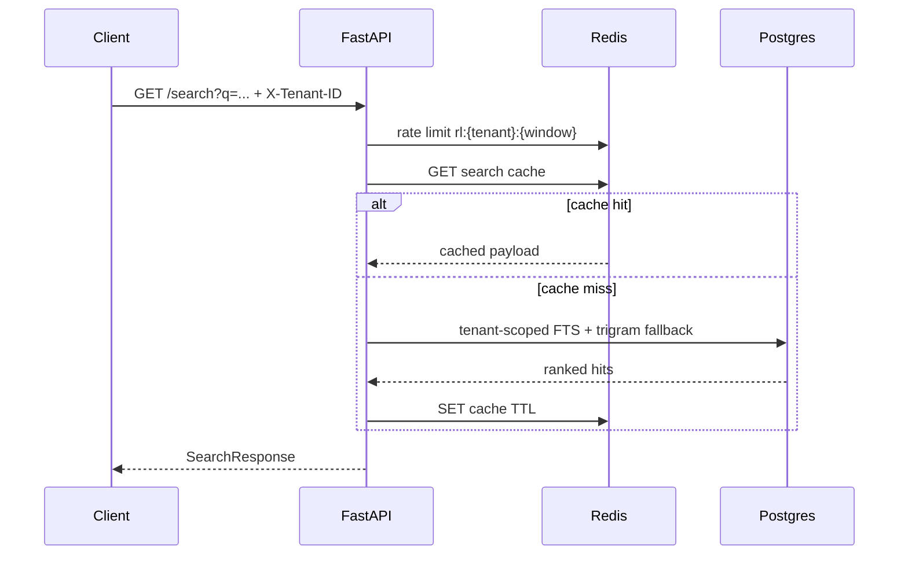

# Distributed Document Search Service — Submission Documentation

This single document consolidates the assessment documentation deliverables.

---

# Architecture Design — Distributed Document Search Service

## 1. High-level system architecture



**Prototype mapping**

| Concern | Prototype | Production direction |
|---------|-----------|----------------------|
| Document store | PostgreSQL | PostgreSQL / object store for blobs + metadata DB |
| Search | Postgres FTS (`tsvector`) | OpenSearch / Elasticsearch cluster, tenant-aware indexes |
| Cache | Redis | Redis Cluster / CDN for anonymized hot queries |
| Async indexing | Redis Streams | Kafka / Pulsar with DLQ and replay |
| Multi-tenancy | `X-Tenant-ID` + row filter | JWT claims + RLS / index-per-tenant |

## 2. Data flows

### Indexing



### Search



## 3. Storage strategy

**PostgreSQL** is the source of truth for documents and, in the prototype, the search engine:

- `documents.search_vector` is a weighted `tsvector` (title = A, content = B)
- GIN index on `search_vector` for ranked retrieval via `websearch_to_tsquery` + `ts_rank_cd`
- `pg_trgm` GIN index on `title` enables fuzzy / typo-tolerant fallback
- Tenant isolation is enforced in every query with `WHERE tenant_id = :tenant`

**Why not Elasticsearch in the prototype?** Compose + ES adds operational weight for a 3–4 hour assessment. Postgres FTS still demonstrates ranking, indexing, and tenant scoping. Production search should move to OpenSearch for shard scaling, analyzers, highlighting, aggregations/facets, and cross-cluster replication.

**Redis** provides:

1. Search result cache (`search:{tenant}:{hash}`)
2. Document cache (`doc:{tenant}:{id}`)
3. Fixed-window rate limits (`rl:{tenant}:{minute}`)
4. Indexing queue (Redis Streams)

## 4. API design

| Method | Path | Notes |
|--------|------|-------|
| `POST` | `/documents` | Body: `{title, content, metadata?}` |
| `GET` | `/documents/{id}` | Tenant-scoped; 404 on cross-tenant |
| `DELETE` | `/documents/{id}` | Hard delete + cache invalidation |
| `GET` | `/search?q=&tenant=&limit=&offset=` | Tenant via `X-Tenant-ID` and/or `tenant` query param |
| `GET` | `/health` | Reports Postgres + Redis; **503** when degraded |

**Example create**

```json
POST /documents
X-Tenant-ID: acme
{"title": "Invoice policy", "content": "Net-30 payment terms...", "metadata": {"dept": "finance"}}
```

**Example search response**

```json
{
  "query": "invoice",
  "tenant_id": "acme",
  "results": [
    {"id": "...", "title": "Invoice policy", "snippet": "...", "score": 0.42, "highlight": "<em>Invoice</em> policy — ..."}
  ],
  "total": 1,
  "took_ms": 12.4,
  "cached": false
}
```

## 5. Consistency model and trade-offs

| Operation | Consistency | Trade-off |
|-----------|-------------|-----------|
| GET document by id | Strong (Postgres) | Read-your-writes after create |
| Search results | Eventually consistent (async worker reassert) | Lower write latency vs brief search lag |
| Cache | TTL + write invalidation | Stale window up to TTL if invalidation races |

Prototype updates `search_vector` synchronously on write **and** enqueues a worker job so the async path is real and production-like. Deletes are immediately removed from Postgres; the stream message is ack-only for deletes.

## 6. Caching strategy

- **L1 (Redis):** hashed query keys per tenant, TTL ~45s
- **Invalidation:** on create/delete, `SCAN` + `UNLINK` for `search:{tenant}:*` and drop `doc:{tenant}:{id}`
- **Production:** prefer cache versioning (`search:{tenant}:v{n}:...`) over SCAN; add negative caching carefully; consider request coalescing for hot keys

## 7. Message queue usage

Redis Streams topic `index.document` carries `{document_id, tenant_id, action}`.

- Consumer group `indexers` enables horizontal worker scale
- Prototype does not implement DLQ; production should use retry + dead-letter + metrics on lag

## 8. Multi-tenancy and isolation

1. Tenant via `X-Tenant-ID` and/or `?tenant=` (must match if both set)
2. Auto-provision tenant row on first write
3. All reads/writes filter by `tenant_id`
4. Cross-tenant access returns **404** (no existence leak via 403)
5. Rate limits apply to **all** document and search routes; cache keys are tenant-partitioned
6. Redis cache/rate-limit failures degrade gracefully (cache miss / fail-open limiter) so Postgres search remains available

**Future isolation tiers:** Postgres RLS, schema-per-tenant for regulated customers, or dedicated OpenSearch index aliases per tenant for noisy-neighbor control.


---

# Production Readiness Analysis

What this prototype would need before serving millions of documents at enterprise SLAs.

## Scalability (100x documents and traffic)

- **Search plane:** migrate FTS to an OpenSearch cluster; shard by tenant hash or time; use index aliases for blue/green reindex.
- **Write path:** keep Postgres (or partitioned Postgres) as system of record; stream CDC (Debezium) into the search cluster to avoid dual-write bugs.
- **Read path:** API replicas behind an L7 load balancer; Redis Cluster for cache; optional edge cache for anonymized public queries.
- **Tenants:** isolate hot tenants onto dedicated index templates / compute pools; enforce per-tenant quotas and burst tokens.
- **Data growth:** partition documents by tenant + month; archive cold content to object storage with searchable stubs.

## Resilience

- Timeouts and deadlines on every dependency call (Postgres, Redis, OpenSearch).
- Retries with exponential backoff + jitter for idempotent reads; bounded retries for writes with idempotency keys.
- Circuit breakers around search backends; degrade to “metadata-only” or cached results when open.
- Queue DLQ + replay tooling; poison-message quarantine.
- Multi-AZ deployment; automated failover for Postgres (Patroni / RDS Multi-AZ) and Redis (sentinel/cluster).
- Chaos experiments for dependency loss and partition scenarios.

## Security

- Replace header-only tenancy with OAuth2/OIDC JWT; bind `tenant_id` from verified claims, never from client-controlled headers alone.
- RBAC: roles for index, search, admin; ABAC for document ACLs inside a tenant.
- TLS everywhere; mTLS for service-to-service traffic.
- Encryption at rest (Postgres TDE / cloud KMS; Redis AUTH + encryption).
- Input validation, max payload sizes, WAF rate limits, audit logging of mutations.
- Regular dependency scanning and secrets management (no credentials in images).

## Observability

- **Metrics:** RED (rate, errors, duration) per endpoint; cache hit ratio; rate-limit rejections; stream lag; FTS/OpenSearch p50/p95/p99.
- **Logs:** structured JSON with `request_id`, `tenant_id`, `document_id`; never log raw document bodies in prod by default.
- **Tracing:** OpenTelemetry across API → Redis → Postgres/OpenSearch → worker.
- **Alerts:** error budget burn, lag SLO, disk saturation, replica lag, certificate expiry.

## Performance

- Connection pooling (PgBouncer); prepared statements; covering indexes for common filters.
- OpenSearch: force-merge policy for read-heavy indexes; careful refresh interval vs indexing latency.
- Query budgets: reject pathological boolean queries; truncate offsets; prefer search-after/cursors.
- Benchmark with realistic tenant skew (Zipf) not uniform load.
- Keep p95 search < 500ms via warm caches, replica reads, and avoiding deep pagination.

## Operations

- GitOps / CI: build, test, migrate, canary, promote.
- Zero-downtime: rolling updates for API/workers; blue-green or dual-write reindex for schema/analyzer changes.
- Backups: Postgres PITR; Redis AOF/RDB as cache-only (rebuildable); OpenSearch snapshots to object storage.
- Runbooks for: search cluster yellow/red, cache stampede, poison index jobs, tenant noisy neighbor.
- Cost controls: index lifecycle management (hot/warm/cold), right-size replicas, cache TTLs tuned to hit rate.

## SLA considerations (99.95% availability)

- Monthly error budget ≈ 22 minutes; gate releases on burn rate.
- N+1 capacity in each AZ; RPO near-zero for metadata (sync replicas), RTO < 15 minutes with automated failover.
- Dependency SLOs composed carefully—cache misses must not cascade into search overload (bulkheads + load shedding).
- Synthetic probes for `/health` and a canary search query per critical tenant tier.
- Status page + customer communication playbooks when budget is burned.

## Cost optimization (bonus)

- Prefer OpenSearch Serverless or reserved nodes only after steady-state sizing.
- Aggressive ILM for infrequently searched tenants.
- Cache hot queries to cut search CU / CPU.
- Compress document bodies; store large attachments in S3 with pointers in Postgres.


---

# Enterprise Experience Showcase

> **Action required before submission:** replace each placeholder with 1–2 paragraphs from your real experience. Interviewers evaluate authenticity and specificity (scale numbers, your role, decision trade-offs, outcome).

## 1. Similar distributed system — scale and impact

**[REPLACE]** Describe a search, indexing, messaging, or multi-tenant platform you built or owned. Include approximate QPS, data volume, number of tenants/services, and business impact (latency, revenue enablement, reliability).

Example structure: problem → your design → scale → measurable outcome.

## 2. Performance optimization with significant improvement

**[REPLACE]** Pick one optimization (query plan, caching, batching, index tuning, N+1 elimination, connection pooling, etc.). State baseline metric, change, and after metric (e.g., p95 1.8s → 220ms). Mention how you validated (load test, prod metrics) and any regressions you watched for.

## 3. Critical production incident in a distributed system

**[REPLACE]** Walk through detection → mitigation → root cause → permanent fix. Prefer incidents involving partial failure, cascading timeouts, data inconsistency, or multi-region issues. Call out what you personally did and what process/tooling improved afterward.

## 4. Architectural decision balancing competing concerns

**[REPLACE]** Example themes: consistency vs latency, build vs buy, shared DB vs service-per-store, multi-tenant isolation strength vs cost. Explain options considered, decision, trade-offs accepted, and how you revisited the decision as scale changed.

---

## Tips

- Prefer concrete numbers over adjectives (“millions of docs”, “3 regions”, “p99”).
- Own your part of the work; credit the team where appropriate.
- Align stories with themes in this assessment: multi-tenancy, search/indexing, resilience, observability.


---

# AI Tool Usage

Built with Cursor (Composer) assistance for scaffolding, API wiring, Docker Compose, documentation drafting, and gap-fix review. Architecture decisions, trade-offs, multi-tenancy/security choices, and production analysis were reviewed and curated for this assessment. Experience showcase entries must be filled with the candidate's own stories before submission.

